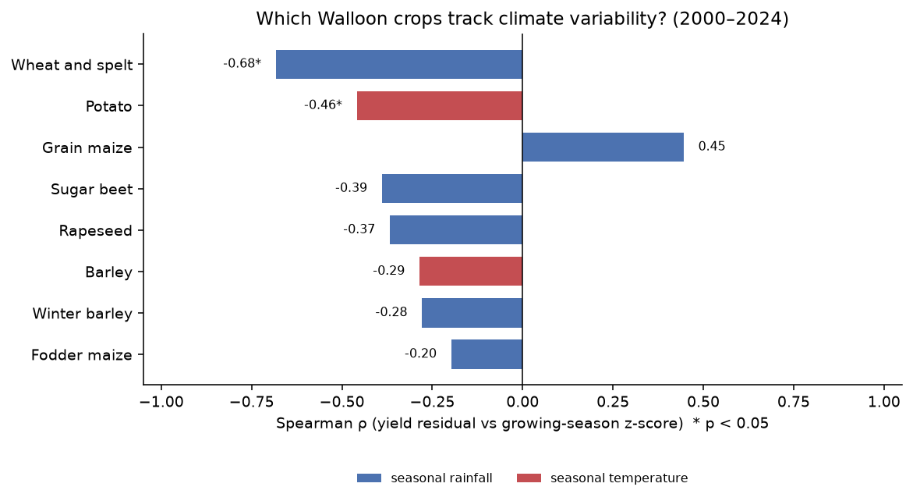
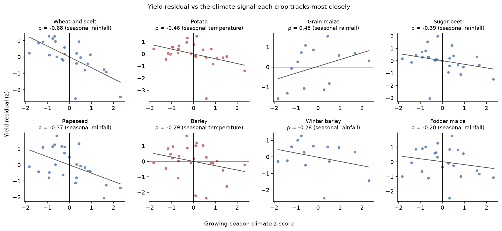
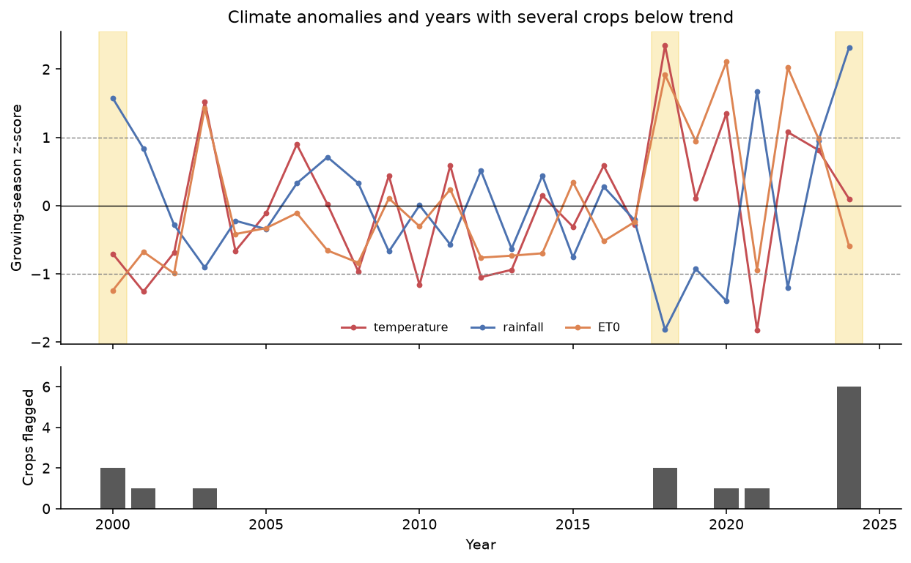
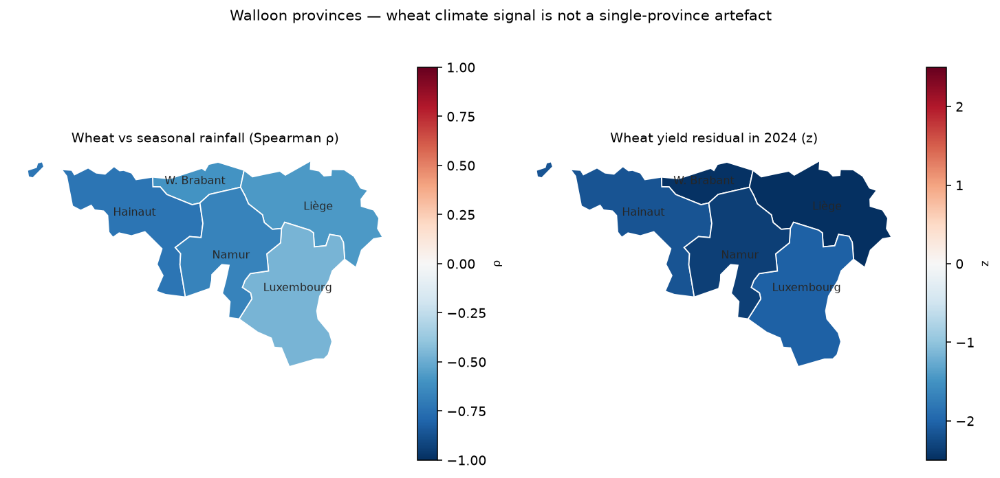
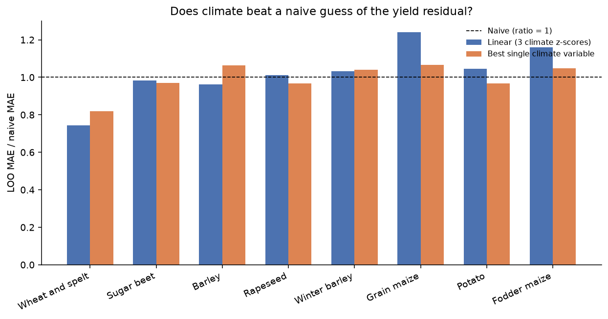

# Agriculture and climate in Wallonia

| | |
|---|---|
| **Stack** |          |
| **Level** | Intermediate |
| **Data specialty** | SQL / heterogeneous-source integration |
| **Status** | **v1.0** — complete (CMIP6 scenarios out of scope) |

## Objective

> Which Walloon crops are most sensitive to recent climate variability,
> and which years were most at risk?

Yields are **annual**; climate is **daily**; the geographies do not line
up either. This project’s core is a **DuckDB** schema that keeps both
grains native and reconciles them in SQL views — then ranks crops by
observed sensitivity for cooperatives, crop insurers and public
administration.

## Data

- **Yields**: Eurostat table `apro_cpshr` (crop area and production at NUTS 1
  Wallonia and NUTS 2 provinces). The national source is Statbel; Eurostat is
  used because it exposes a stable TSV API. Period: 2000–2024. Crops: wheat
  and spelt, barley, winter barley, grain maize, fodder maize, potatoes,
  sugar beet, rapeseed.
- **Climate**: Open-Meteo Archive (ERA5 reanalysis) at five provincial
  centroids — **daily** temperature, precipitation and FAO ET0, stored at
  that native grain in DuckDB. SQL views aggregate to month / year /
  growing-season (April–September): mean for temperature, sum for rainfall
  and ET0, and counts of days above explicit thresholds (Tmax ≥ 25 °C,
  rainfall ≥ 10 mm, dry day < 1 mm). Wallonia = unweighted mean of the
  five points (a view, not a sixth station). Annual series include
  anomalies and z-scores versus the 2000–2024 mean of each territory
  (`AVG` / `STDDEV_SAMP` window functions, `PARTITION BY geo`).

Raw files stay in `data/raw/` (not committed). Native-grain tables
(`rendements.csv`, `climat_quotidien.csv`) and SQL exports live in
`data/processed/`. The warehouse file `agri_climat.duckdb` is regenerable
(`python -m agri_climat join`) and not committed.

## Method

**Why this schema.** Two fact tables at different grains, one shared year
dimension: `fact_rendements` (year × crop × territory) and
`fact_climat_quotidien` (day × province). Wallonia and the annual climate
cube are **views**, not pre-merged pandas tables — the aggregate choices
stay visible in `sql/schema.sql`. A view rather than a materialized table:
~45 k daily rows recompute instantly, and changing a threshold (25 °C,
April–September) does not require a hidden notebook step.

1. Load native-grain CSVs into DuckDB; `INNER JOIN (geo, year)` in
   `v_rendements_climat` (orphan years dropped).
2. **Detrend** each crop’s yield (linear year → t/ha, also as
   `regr_slope` / `regr_intercept` in `v_rendements_residus`) so genetic /
   technical progress is not mistaken for a climate effect.
3. Correlate the **residual** with growing-season z-scores (temperature,
   rainfall, ET0). Main indicator: **Spearman** (ranks, robust to extremes);
   Pearson as a check. Wallonia first; provinces only as a sign check
   (not pooled — they are not independent draws). SQL equivalent:
   `corr(RANK(), RANK())` in `sql/queries.sql`; p-values come from scipy.
4. Flag an **at-risk year** when the yield residual is ≤ −1 σ **and** at
   least one climate |z| is ≥ 1. That joint filter avoids labelling a
   technical dip or a wild climate year with no yield signal.
5. Fit a **linear baseline** (residual ~ seasonal temperature, rainfall
   and ET0 z-scores) and score it with leave-one-year-out MAE against a
   naive guess of 0. Provinces are not pooled.

A simple composite **climate-risk index** per crop (`v_indice_risque`)
weights seasonal |z| only on years below the yield trend — a ranking, not
an insurance probability.

Full numbers and caveats: `docs/analyse.md` (statistics) and
`docs/ml.md` (linear baseline). Schema comments: `sql/schema.sql`.

## Results

On Wallonia 2000–2024, **wheat and spelt** show the clearest climate
co-movement: seasonal rainfall, Spearman ρ ≈ −0.68 (p < 0.05). Wetter
seasons tend to sit **below** the yield trend. **Potato** tracks seasonal
heat (ρ ≈ −0.46). Other crops are weaker or based on shorter series
(grain maize and winter barley ≈ 14 years).



Each panel below plots the yield residual against the climate variable
that crop tracks most closely. The grey line is a visual fit, not a causal
model.



**2024** (very wet) flags six crops, including wheat. **2018** (hot and
dry) flags grain maize and potato. **2000** (wet) flags rapeseed and
barley. Gold bands mark years with at least two crops below trend.



The wheat–rainfall signal is **negative in every Walloon province** (not a
Wallonia-only artefact). In **2024**, wheat residuals sit below trend
across the region. Boundaries: © Eurostat GISCO, NUTS 2021, 1:10 million.



**Takeaway for a sector reader** (cooperative, insurer, administration):
watch **wheat in very wet growing seasons** and **potato / grain maize in
hot-dry summers**. Treat this as an observed co-movement, not a forecast
and not a proof that rainfall *caused* the 2024 wheat dip.

A simple linear check (leave-one-year-out) agrees for **wheat**: climate
cuts the typical residual error from 0.51 to 0.38 t/ha (R² ≈ 0.40),
mainly via rainfall. For most other crops the three-variable model does
**not** beat “stay on trend” — small samples and collinear heat / ET0.
Bars below 1 mean climate beats that naive guess.



## Dashboard

Two ways in, same numbers as this report:

- **In the browser (no Python)** — from the slides footer, or
  [explore FR](https://dimiphoton.github.io/agriculture-climat-wallonie/explore-fr.html)
  /
  [explore EN](https://dimiphoton.github.io/agriculture-climat-wallonie/explore-en.html).
  Crop dropdown + year rangeslider. Regenerated by
  `python -m agri_climat slides`.
- **Local Streamlit** (map, atypical years, period filter):

```bash
python -m agri_climat dashboard
```

Equivalent: `streamlit run webapp/app.py`. Needs `data/processed/` already
built (`python -m agri_climat run` or at least `join` + `map` for the
choropleth). This command is **not** part of `run` (it starts a server).
The ranking table is always the full-series Wallonia result — the year
slider does not recompute it.

## Limits

- Correlation is not causation. Prices, pests, irrigation and variety
  changes are not in the model.
- One ERA5 point per provincial centroid; Wallonia is an unweighted mean —
  not the climate of a given field.
- One growing-season calendar (April–September) for every crop.
- Linear detrend is an approximation. Eurostat methodology breaks can
  remain in the residual.
- p-values are not corrected for testing several crops × three climate
  variables.
- Observation 2000–2024 only. CMIP6 / SSP scenarios are **out of v1.0**
  (a different question: future impacts, not observed sensitivity).
  The linear model is not a forecast: 2016’s wheat dip is poorly
  captured out of sample.
- The map is **five NUTS 2 provinces**, not municipalities or fields.
  GISCO 1:10 million outlines are schematic.
- Leave-one-year-out on n ≈ 14–25 is noisy. MAE in t/ha is the headline
  metric; a negative R² means the three climate z-scores add error.

## Reproduce

Python 3.11+ required.

```bash
pip install -e ".[dev]"
python -m agri_climat run
pytest
```

Useful commands:

```bash
python -m agri_climat download          # raw files only
python -m agri_climat clean             # rebuild processed climate/yield tables
python -m agri_climat join              # DuckDB + SQL views + docs/eda.md
python -m agri_climat sql               # replay sql/queries.sql
python -m agri_climat eda               # tables + PNG, no GUI
python -m agri_climat analyse           # correlations, atypical years, wheat
python -m agri_climat figures           # README PNGs in pictures/readme/
python -m agri_climat map               # provincial choropleth (wheat)
python -m agri_climat ml                # linear baseline, LOO vs naive
python -m agri_climat slides            # slide PNGs + docs/explore-*.html
python -m agri_climat dashboard        # Streamlit app (not part of run)
python -m agri_climat download climat   # climate only
python -m agri_climat download nuts     # GISCO NUTS 2 polygons
```

Internet access is needed for the first download (Eurostat and Open-Meteo).
Afterwards, `clean`, `join`, `sql`, `analyse`, `figures`, `map` and `ml`
work offline from `data/raw/` (`join` needs the native-grain CSVs;
`sql` needs `agri_climat.duckdb`; `map` needs the processed NUTS GeoJSON).
Fast preview (no Jupyter window):

```bash
python -m agri_climat eda
python -m agri_climat figures
python -m agri_climat map
python -m agri_climat ml
```

Do not use `plt.show()` — on Windows the Tk window can hang for minutes.
Optional notebooks (kernel = project `.venv`):
`notebooks/02-eda-jointure.ipynb`, `notebooks/03-analyse.ipynb`,
`notebooks/04-figures.ipynb`, `notebooks/05-carte.ipynb`,
`notebooks/06-ml.ipynb`.

## Repo structure

```
brief/                 # original goal and portfolio brief
sql/                   # DuckDB schema + crossing queries (the integration layer)
data/raw/              # downloaded files (gitignored)
data/processed/        # native-grain CSVs + SQL view exports (CSV / Parquet)
src/agri_climat/       # download, clean, warehouse, analyse, figures, map, ml, dashboard, slides, CLI
webapp/                # Streamlit app (calls src/, no duplicated logic)
notebooks/             # notebooks (call src/, no duplicated logic)
tests/                 # unit tests
docs/                  # decisions, EDA, Marp sources, GitHub Pages (slides + explore + slide PNG)
pictures/experiments/  # analysis PNG (French labels)
pictures/readme/       # polished README figures (English labels)
```

See also `ROADMAP.md` and `JOURNAL.md` (French, like the rest of the
codebase comments).

## Presentations

GitHub Pages (slideshow in the browser — not the HTML source on
`github.com`). The [hub](https://dimiphoton.github.io/agriculture-climat-wallonie/)
states the question and the stack; the footer on every slide opens the
dashboard.

- [Recruiter overview (EN)](https://dimiphoton.github.io/agriculture-climat-wallonie/slides/presentation-recruteur-en.html)
- [Technical deep dive (EN)](https://dimiphoton.github.io/agriculture-climat-wallonie/slides/presentation-technique-en.html)
- [Présentation grand public (FR)](https://dimiphoton.github.io/agriculture-climat-wallonie/slides/presentation-recruteur-fr.html)
- [Présentation technique (FR)](https://dimiphoton.github.io/agriculture-climat-wallonie/slides/presentation-technique-fr.html)
- [Dashboard (FR)](https://dimiphoton.github.io/agriculture-climat-wallonie/explore-fr.html)
- [Dashboard (EN)](https://dimiphoton.github.io/agriculture-climat-wallonie/explore-en.html)
