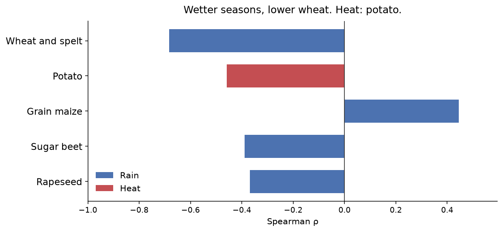
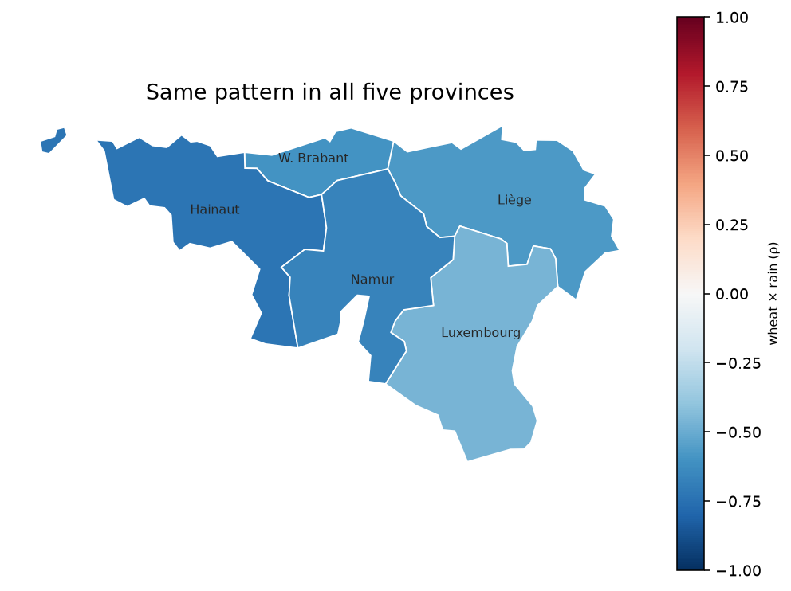

# Which Walloon crops
# are hit by recent climate?

Wallonia · 2000–2024 · report + dashboard

---

## Who is this for?

Cooperatives, crop insurers, public bodies: **which crops**,
**which years** — not a 2050 forecast.

---

## What did we find?

In **very wet** years, **wheat** yields sit lower (especially 2024).
In **hot** summers, so does **potato**.

---

## Is this true everywhere in Wallonia?

Yes: the wheat–rain link has the **same sign** in all five provinces.

---

## What do we do on Monday?

- Watch **wheat** in **very wet** seasons.
- Watch **potato** in **hot** summers.
- Watch **grain maize** in **dry** seasons.

Not proven causation — a bundle of clues.

---

## Can we explore it?

**[Open the dashboard](../explore-en.html)** — crop and period, in the
browser (same link in the footer of every slide).

Code: [GitHub](https://github.com/dimiphoton/agriculture-climat-wallonie)
