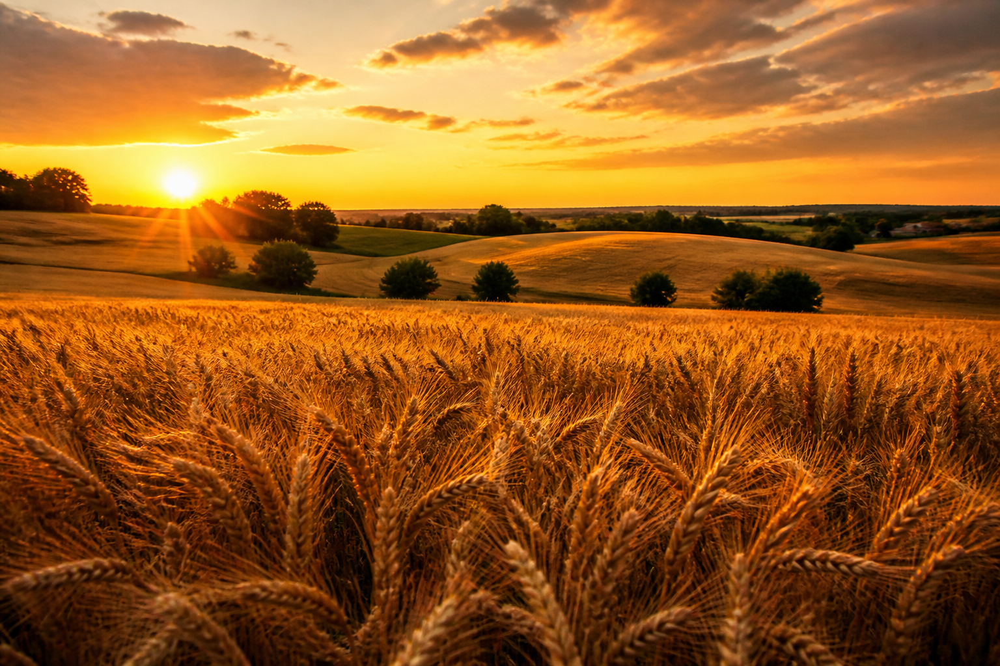
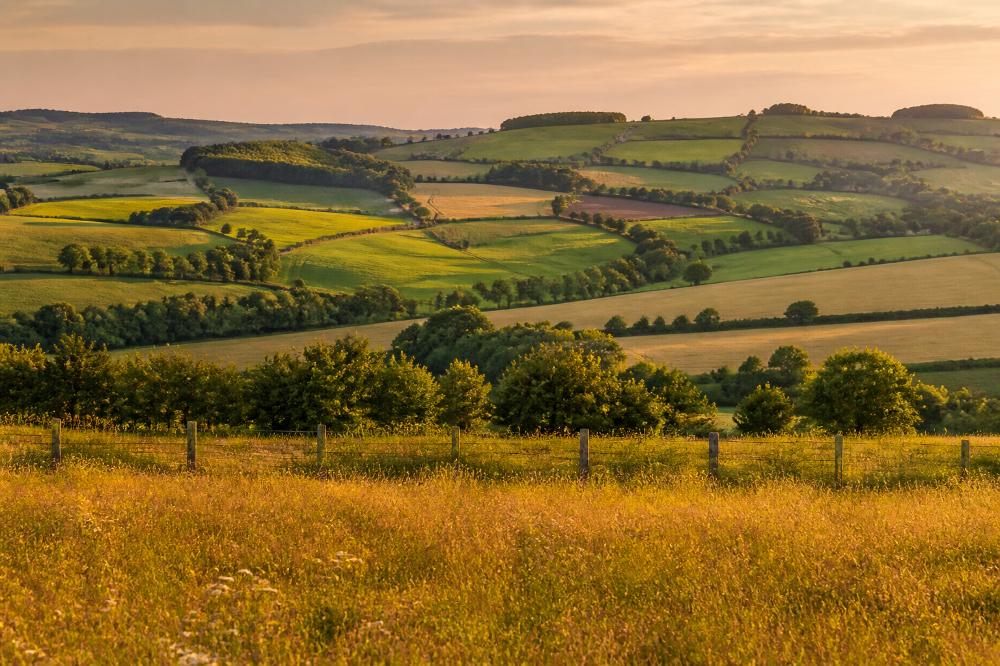
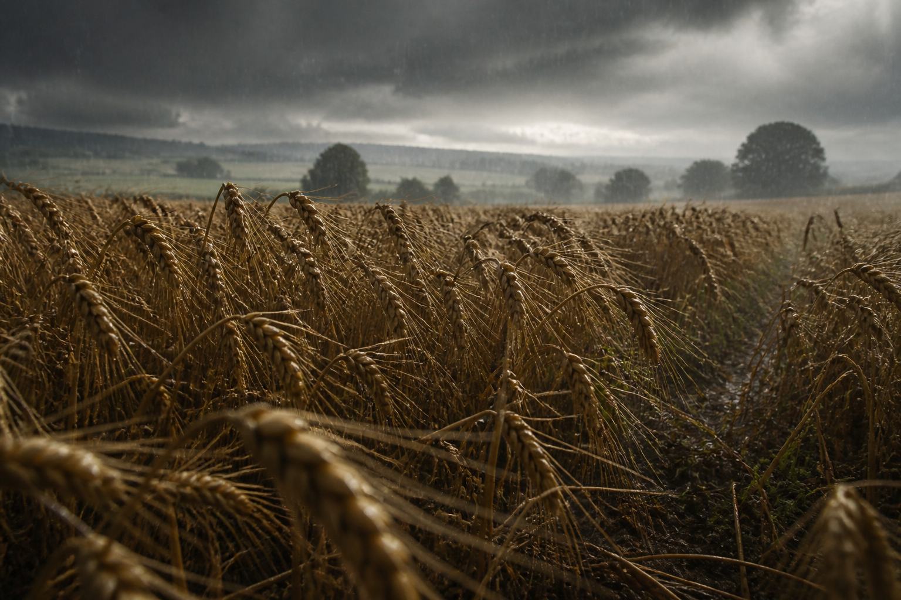
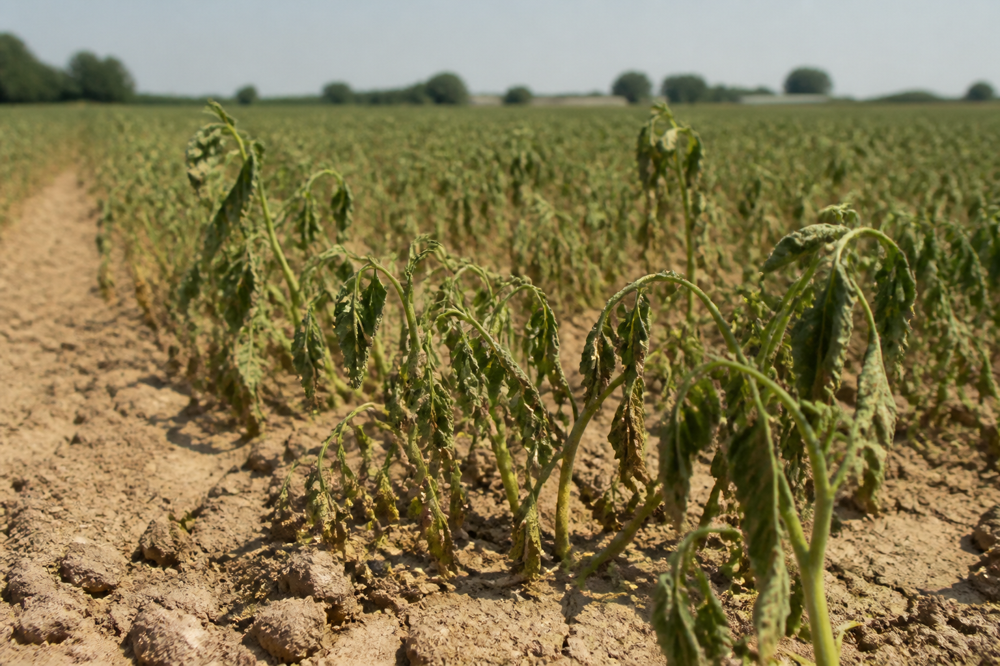
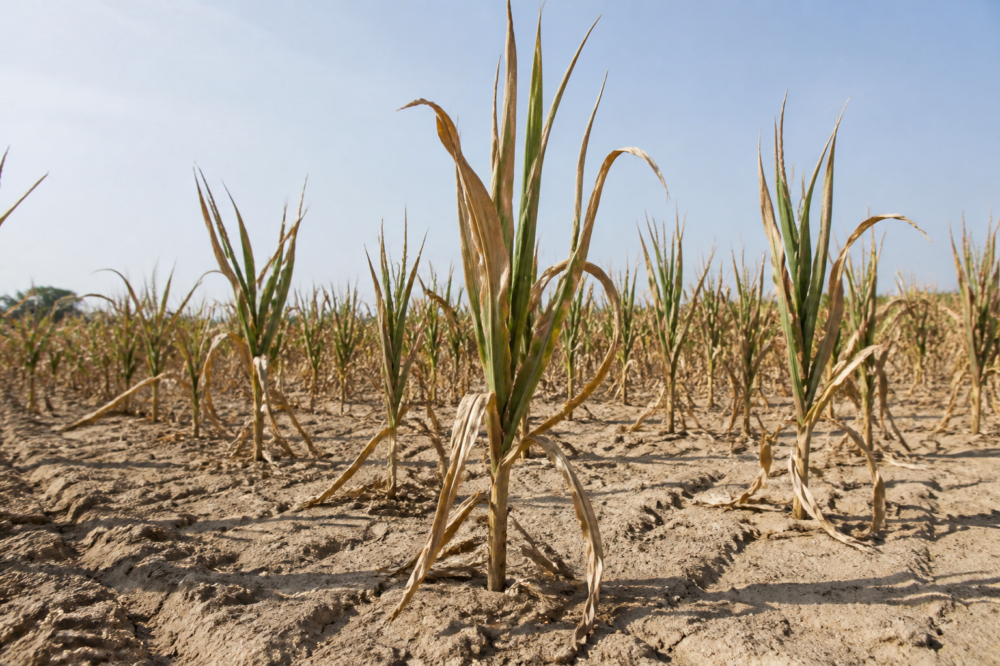

<!-- _class: cover -->
<!-- _paginate: false -->

# Which crops
# are really hit
# by recent climate?

Wallonia · 2000–2024

---

<!-- _class: split -->

# Not 2050.

Cooperatives. Insurers. Public bodies.

**Which crops. Which years.**

---

<!-- _class: full -->

# Too much rain.
# Less wheat.

Especially 2024.

---

<!-- _class: full -->

# Too much heat.
# Less potato.

---

<!-- _class: chart -->

The ranking — what actually holds.

---

<!-- _class: split -->

# True in all
# five provinces.

---

<!-- _class: actions -->

# Monday.

**Wheat** — very wet seasons.

**Potato** — summers that scorch.

**Grain maize** — dry seasons.

Not causation. A bundle of clues.

---

<!-- _class: cta -->

# Your turn.

[Open the dashboard](../explore-en.html)

[Source code](https://github.com/dimiphoton/agriculture-climat-wallonie)
