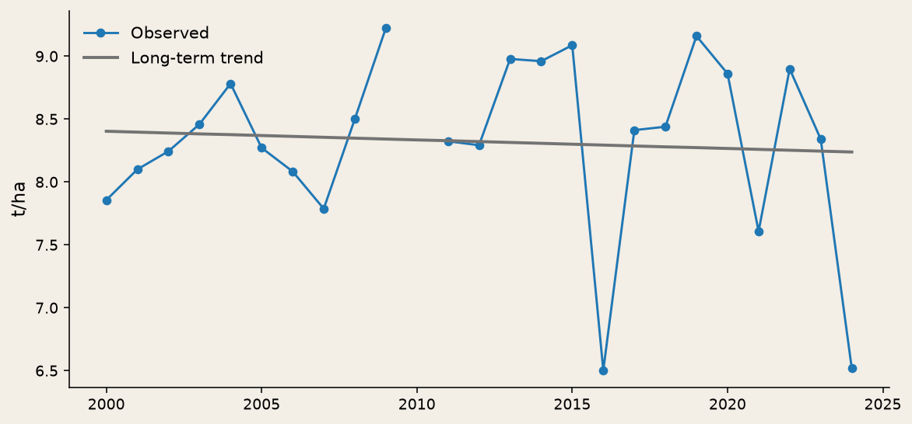
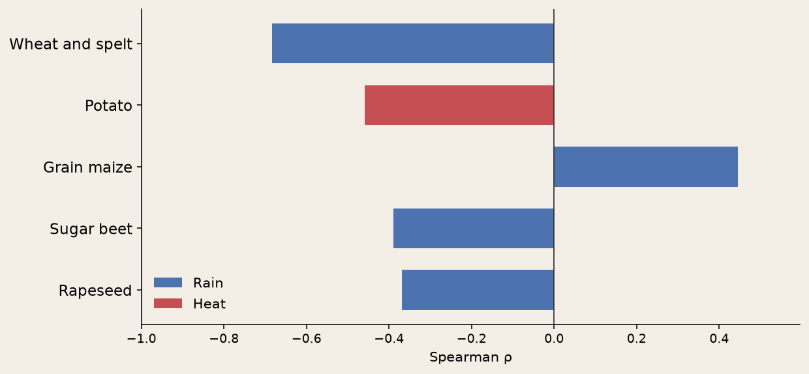
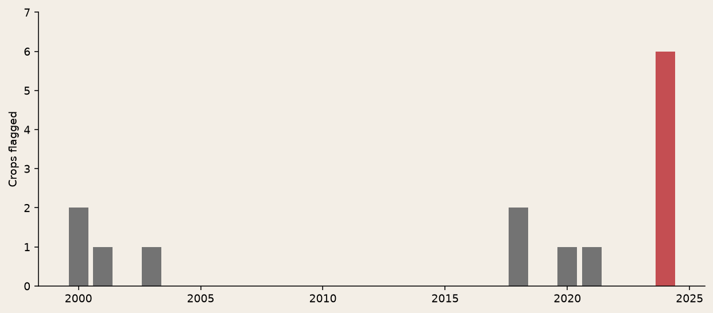
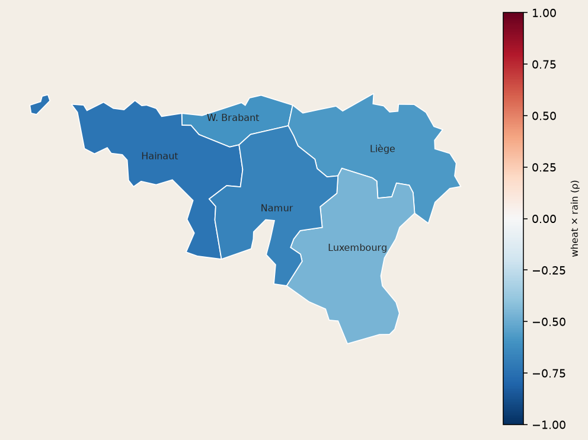

<!-- _class: cover -->
<!-- _paginate: false -->

# Which Walloon crops
# are sensitive to climate?

**SQL integration × agricultural data**

DuckDB · Wallonia · 2000–2024

---

<!-- _class: story -->

## Why this subject

Geomatics is about **territory**. So is farming:
provinces, seasons, fields.

Joining yields and climate is the same move as soil-carbon
or agronomic advice — the kind of work a team like **Soil Capital** does.

---

<!-- _class: story -->

## The problem

Yields swing from year to year. Cooperatives, insurers and public bodies
need to **prioritise**: which crops, which years.

Not a 2050 scenario. Two official tables that **do not fit**:
annual yields, daily climate, mismatched geographies.
DuckDB realigns the grains; a provincial map checks the sign.

**Data:** Eurostat yields (Statbel) and ERA5 climate (Open-Meteo).

---

<!-- _class: chart -->

## The work: split progress from climate

First we remove the trend (genetics, technique). Climate is the **gap**.
Walloon wheat — the **2024** dip is not the grey line.

---

<!-- _class: chart -->

## Result: wheat tracks rainfall

Rank correlation of the yield **gap** (after removing the trend) with
growing-season climate. Wheat falls in wetter seasons. Potato tracks heat.

---

<!-- _class: chart -->

## At-risk years

Joint filter: yield well below trend **and** extreme climate.
**2024** (very wet) flags six crops.

---

<!-- _class: chart -->

## Geography confirms it

Same sign (wheat × rain) in all five provinces. We do **not** mix
territories as if they were independent draws.

---

<!-- _class: story -->

## What to do with it

- **Wheat** — very wet growing seasons (like 2024)
- **Potato / grain maize** — hot-dry summers (like 2018)

Correlation is not causation. Prices, pests and varieties are not in the model.

[Explore the series](../explore-en.html)
· [Source code](https://github.com/dimiphoton/agriculture-climat-wallonie)
