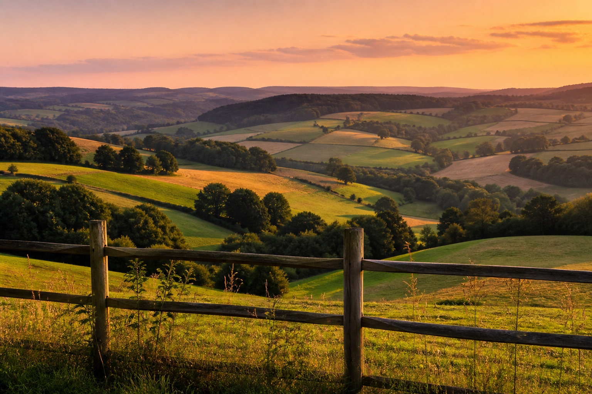
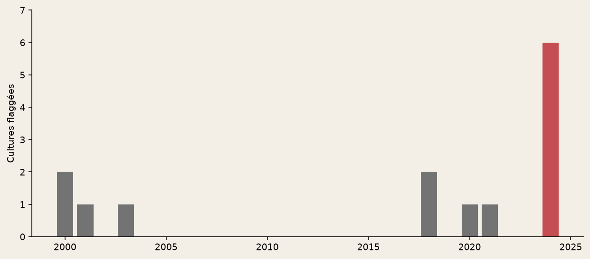
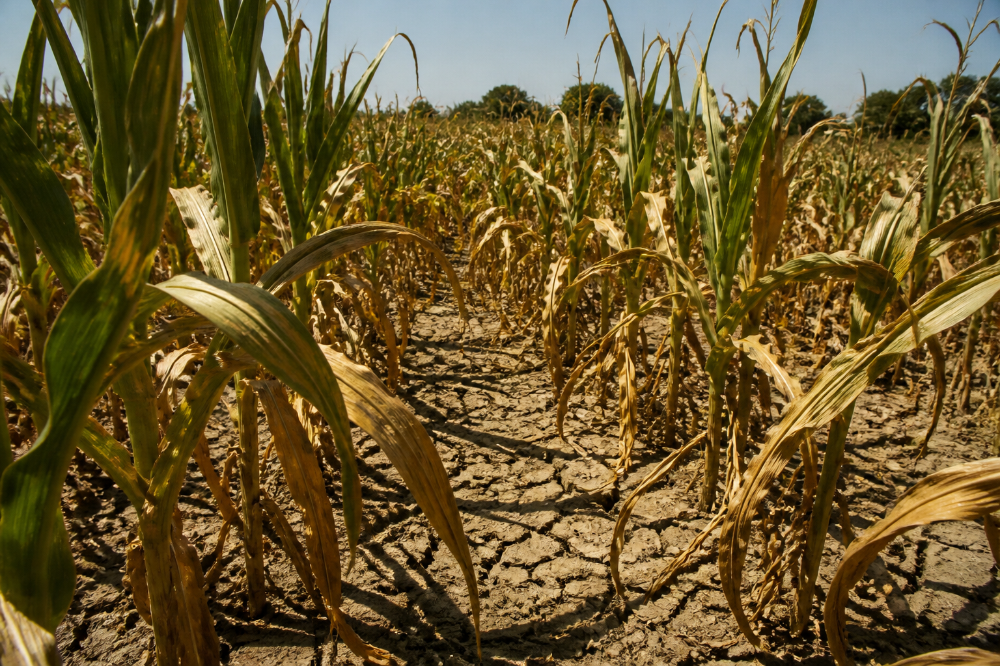

<!-- _class: cover -->
<!-- _paginate: false -->

# Quelles cultures wallonnes
# sont sensibles au climat ?

Rendements **annuels** × climat **journalier** — recalé en SQL.

DuckDB · Wallonie · 2000–2024

---

<!-- _class: photo -->

## Pourquoi ce sujet

La géomatique, c'est le **territoire**. L'agriculture aussi :
provinces, saisons, parcelles.

Croiser rendements et climat, c'est le même geste que pour le
carbone des sols ou le conseil agronomique — le type de travail
d'une équipe comme **Soil Capital**.

---

<!-- _class: photo -->

## Le problème

Les récoltes varient d'une année à l'autre. Coopératives, assureurs
et administration veulent **prioriser** : quelles cultures, quelles années.

Pas un scénario 2050. Deux tables officielles qui **ne s'emboîtent pas** :
rendements annuels, climat journalier, géographies différentes.
DuckDB recale les grains ; une carte des provinces contrôle le signe.

**Données :** rendements Eurostat (Statbel) et climat ERA5 (Open-Meteo).

---

<!-- _class: chart -->

## Le travail : séparer progrès et climat

On retire d'abord la tendance (génétique, technique). Le climat, c'est
l'**écart**. Ici le froment wallon — le creux de **2024** n'est pas la droite.

---

<!-- _class: chart -->

## Résultat : le froment suit la pluie

Corrélation de rangs entre l'**écart** au rendement et le climat de saison.
Le froment baisse quand la saison est plus humide. Pomme de terre : la chaleur.

---

<!-- _class: chart -->

## Années à risque

Filtre joint : rendement nettement sous la tendance **et** climat
extrême. **2024** (très humide) flagge six cultures.

---

<!-- _class: chart -->

## La géographie confirme

Même signe (froment × pluie) dans les cinq provinces. On ne mélange **pas**
les territoires comme s'ils étaient indépendants.

---

<!-- _class: photo -->

## Ce qu'on en fait

- **Froment** — saisons de végétation très humides (comme 2024)
- **Pomme de terre / maïs grain** — étés chauds et secs (comme 2018)

Corrélation ≠ cause. Prix, ravageurs et variétés ne sont pas dans le modèle.

[Explorer les séries](../explore-fr.html)
· [Code source](https://github.com/dimiphoton/agriculture-climat-wallonie)
