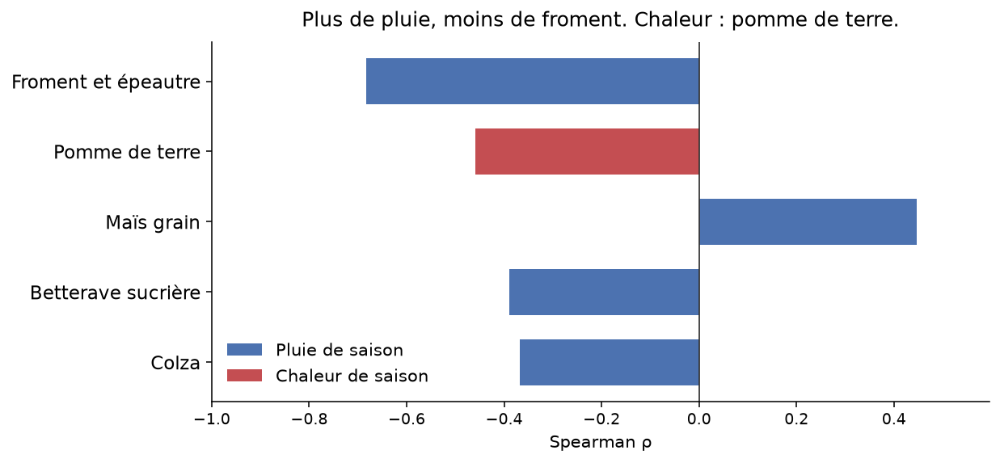

# Quelles cultures wallonnes
# souffrent du climat récent ?

Wallonie · 2000–2024 · rapport + tableau de bord

---

## À qui ça sert ?

Coopératives, assureurs récolte, administration : **quelles cultures**,
**quelles années** — pas une prévision 2050.

---

## Qu’est-ce qu’on a trouvé ?

Les années **très pluvieuses**, le **froment** est plus bas (surtout 2024).
Les étés **chauds**, la **pomme de terre** aussi.

---

## C’est vrai partout en Wallonie ?

Oui : le lien froment–pluie a le **même sens** dans les cinq provinces.

---

## Qu’est-ce qu’on en fait lundi ?

- Surveiller le **froment** les années **très humides**.
- Surveiller la **pomme de terre** les étés **chauds**.
- Surveiller le **maïs grain** les saisons **sèches**.

Ce n’est pas une cause prouvée — un faisceau d’indices.

---

## On peut explorer soi-même ?

**[Ouvrir le tableau de bord](../explore-fr.html)** — culture, période,
dans le navigateur (le lien est aussi en bas de chaque slide).

Code : [GitHub](https://github.com/dimiphoton/agriculture-climat-wallonie)
