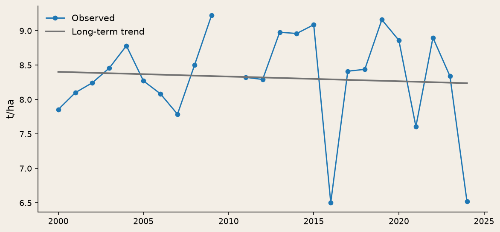
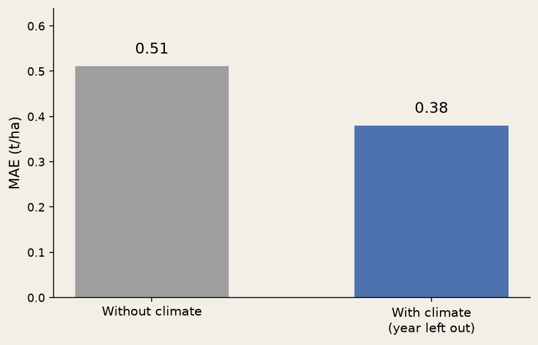

<!-- _class: cover -->
<!-- _paginate: false -->

# Does climate explain
# yield gaps?

Wallonia · 2000–2024

---

<!-- _class: split -->

# This is not
# genetic progress.

We remove the trend. Climate is the gap.

---

<!-- _class: chart -->

Walloon wheat: observed vs trend.

---

<!-- _class: full -->

# Wheat × rain
# ρ ≈ −0.68

Spearman on the residual. Small n. Ranks.

---

<!-- _class: chart -->

The five clearest signals.

---

<!-- _class: split -->

# No pooling.

Same sign everywhere. Provinces are not independent draws.

---

<!-- _class: chart -->

Why not XGBoost? n = 14–25. A line + leave-one-year-out.

---

<!-- _class: dark -->

# Where it breaks.

One ERA5 point per province.

One April–September calendar.

Correlation ≠ cause.

No CMIP6 scenario.

---

<!-- _class: cta -->

# Reproduce.

[Explore online](../explore-en.html)

`python -m agri_climat run`

`python -m agri_climat dashboard`

Python · scikit-learn · Streamlit
