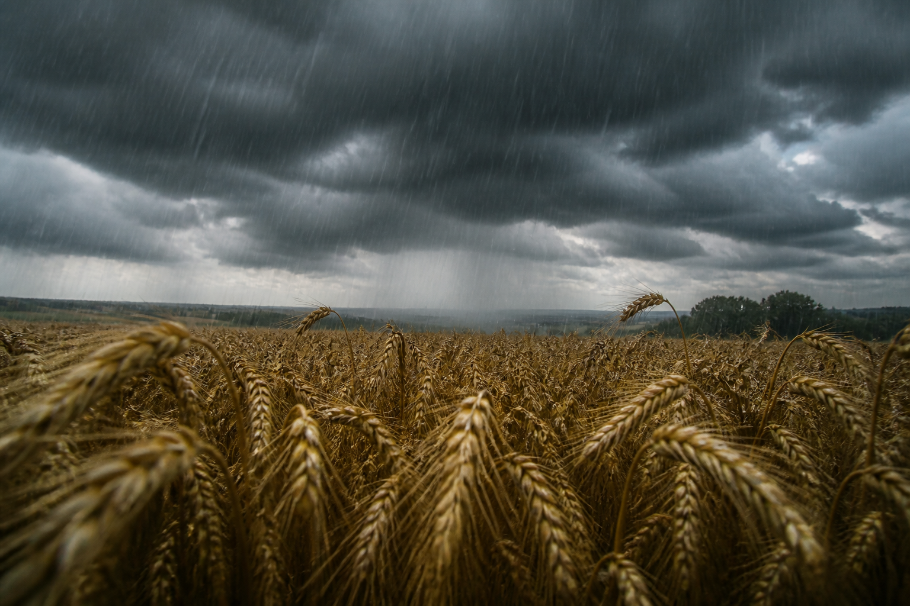

<!-- _class: cover -->
<!-- _paginate: false -->

# Does climate explain
# yield gaps?

**Relational pipeline** · DuckDB · mismatched grains

NUTS 2 geomatics as a sign check · Wallonia · 2000–2024

---

<!-- _class: story -->

## Pipeline

1. **Extract** — Eurostat `apro_cpshr` (TSV) + Open-Meteo / ERA5 (JSON)
2. **Load** — native grains: **annual** yields, **daily** climate
3. **SQL views** — day → year (mean / sum / days above threshold); Wallonia = AVG of 5 points
4. **Window** — z-scores `PARTITION BY geo`; OLS `regr_slope` to detrend
5. **Analyse** — Spearman on the residual (scipy + SQL ranks), NUTS 2 map

`python -m agri_climat run` replays the whole chain. Schema: `sql/schema.sql`.

---

<!-- _class: story -->

## SQL logic (DuckDB, not a `pd.merge`)

Climate stays daily in the warehouse. The annual cube is a **view**.

- **Grains**: `fact_rendements` (year × crop) vs `fact_climat_quotidien` (day)
- **INNER JOIN** `(geo, year)` in `v_rendements_climat` — not LEFT
- **Explicit aggregates**: AVG(temp), SUM(rain / ET0), COUNT(Tmax ≥ 25 °C)
- **Window**: z-scores `PARTITION BY geo`; 5-year moving average; `RANK`
- **No UNION** of the five provinces (no pooling: same year, similar climate)

Files: `sql/schema.sql`, `sql/queries.sql`.

---

<!-- _class: chart -->

## Method: detrend first

OLS year → t/ha. Target = **residual**. Otherwise genetic progress
is mistaken for climate. Walloon wheat, 2024 dip.

---

<!-- _class: chart -->

## Indicator: Spearman on the residual

n = 14–25, robust to extremes. Pearson as a check.
Wheat × seasonal rain: ρ ≈ **−0.68** (p < 0.05).

---

<!-- _class: chart -->

## Geomatics check: no pooling

Provinces are not independent draws.
We check the **sign** on the NUTS 2 map; we do not inflate n.

---

<!-- _class: chart -->

## Check: a line, not XGBoost

Leave-one-year-out MAE vs naive (predict 0). Wheat: 0.51 → **0.38 t/ha**.
Most other crops do not beat naive (small n, collinear ET0).

---

<!-- _class: photo -->

## Where it breaks

- One ERA5 point per province; Wallonia = unweighted mean
- One crop calendar for all species
- Correlation ≠ causation (prices, pests, irrigation missing)
- No CMIP6 / SSP projection

[Explore](../explore-en.html)
· `python -m agri_climat run` · `python -m agri_climat dashboard`

Python · DuckDB (views, windows) · pandas (parse) · scipy · scikit-learn · Streamlit
