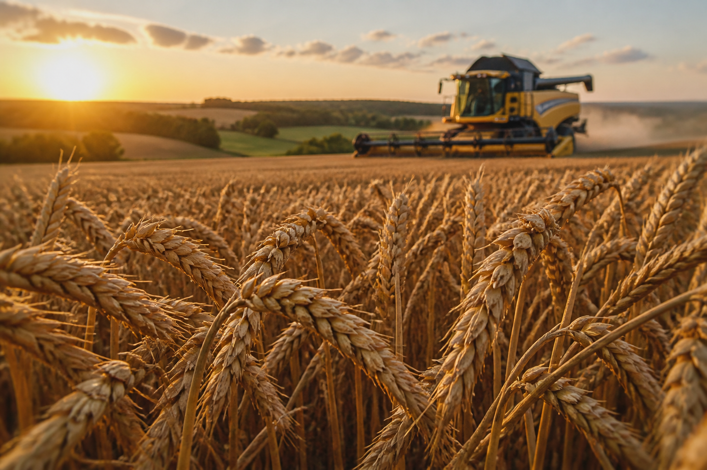
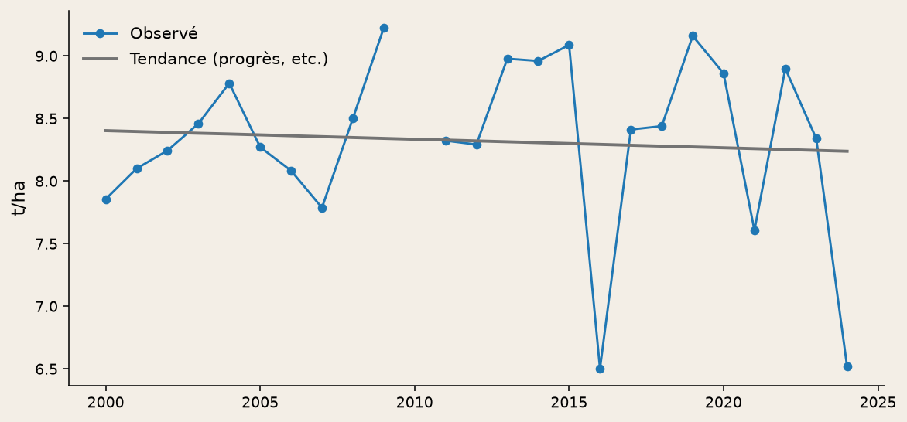
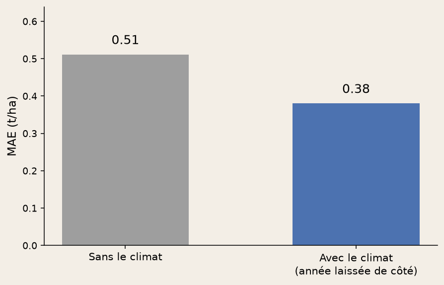

<!-- _class: cover -->
<!-- _paginate: false -->

# Le climat explique-t-il
# les écarts de rendement ?

Wallonie · 2000–2024

---

<!-- _class: split -->

# Ce n'est pas
# le progrès
# génétique.

On retire la tendance. Le climat, c'est l'écart.

---

<!-- _class: chart -->

Froment wallon : observé vs tendance.

---

<!-- _class: full -->

# Froment × pluie
# ρ ≈ −0,68

Spearman sur le résidu. n petit. Rangs.

---

<!-- _class: chart -->

Les cinq signaux les plus nets.

---

<!-- _class: split -->

# Pas de pooling.

Même signe partout. Les provinces ne sont pas indépendantes.

---

<!-- _class: chart -->

Pourquoi pas un XGBoost ? n = 14–25. Une droite + leave-one-year-out.

---

<!-- _class: dark -->

# Où ça casse.

Un point ERA5 par province.

Un calendrier unique avril–septembre.

Corrélation ≠ cause.

Pas de scénario CMIP6.

---

<!-- _class: cta -->

# Reproduire.

[Explorer en ligne](../explore-fr.html)

`python -m agri_climat run`

`python -m agri_climat dashboard`

Python · scikit-learn · Streamlit
