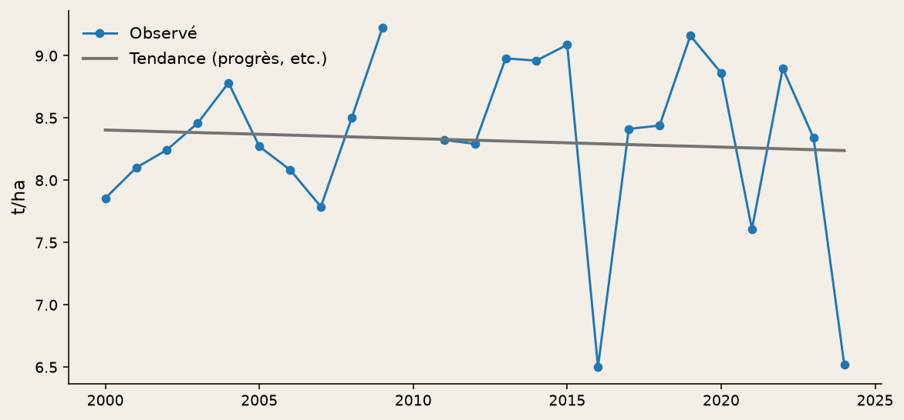
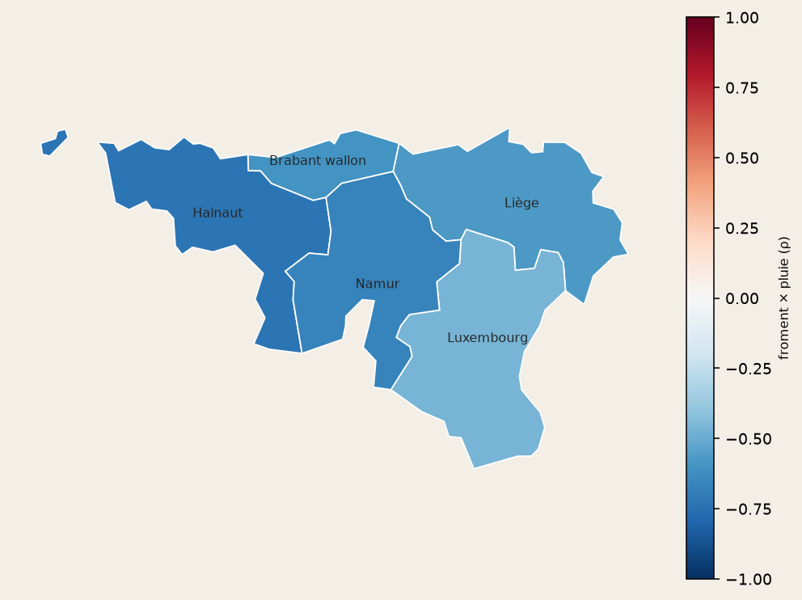
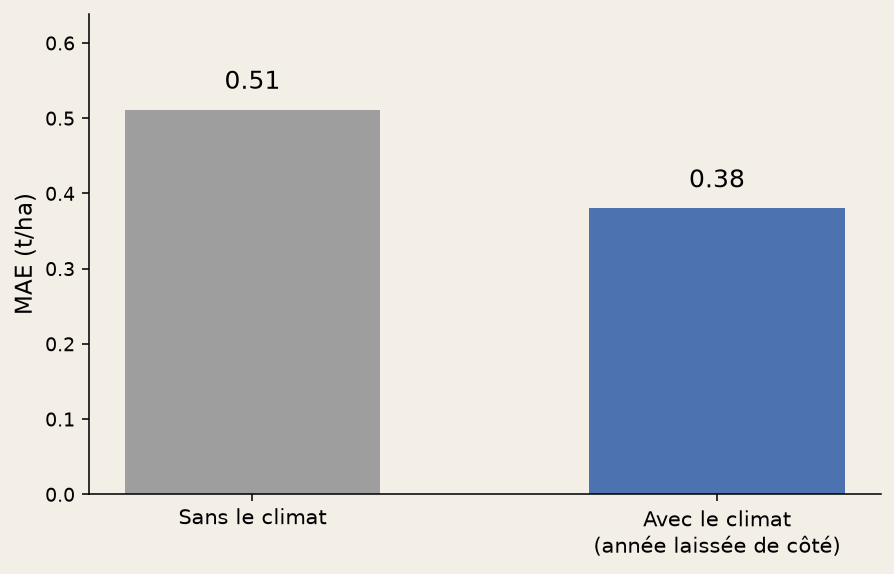

<!-- _class: cover -->
<!-- _paginate: false -->

# Le climat explique-t-il
# les écarts de rendement ?

**Pipeline relationnel** · DuckDB · grains hétérogènes

Géomatique NUTS 2 en contrôle de signe · Wallonie · 2000–2024

---

<!-- _class: story -->

## Pipeline

1. **Extract** — Eurostat `apro_cpshr` (TSV) + Open-Meteo / ERA5 (JSON)
2. **Load** — faits au grain natif : rendements **annuels**, climat **journalier**
3. **Vues SQL** — jour → année (moyenne / cumul / jours > seuil), Wallonie = AVG des 5 points
4. **Fenêtre** — z-scores `PARTITION BY geo` ; OLS `regr_slope` pour le detrend
5. **Analyse** — Spearman sur le résidu (scipy + rangs SQL), carte NUTS 2

`python -m agri_climat run` rejoue toute la chaîne. Schéma : `sql/schema.sql`.

---

<!-- _class: story -->

## Logique SQL (DuckDB, pas un `pd.merge`)

Le climat reste journalier en base. L'annuel est une **vue**.

- **Grains** : `fact_rendements` (année × culture) vs `fact_climat_quotidien` (jour)
- **INNER JOIN** `(geo, year)` dans `v_rendements_climat` — pas de LEFT
- **Agrégats explicites** : AVG(temp), SUM(pluie / ET0), COUNT(Tmax ≥ 25 °C)
- **Fenêtre** : z-scores `PARTITION BY geo` ; moyenne mobile 5 ans ; `RANK`
- **Pas de UNION** des cinq provinces (pas de pooling : même année, climat proche)

Fichiers : `sql/schema.sql`, `sql/queries.sql`.

---

<!-- _class: chart -->

## Méthode : on détrend d'abord

OLS année → t/ha. Cible = **résidu**. Sinon le progrès génétique
se confond avec le climat. Froment wallon, creux 2024.

---

<!-- _class: chart -->

## Indicateur : Spearman sur le résidu

n = 14–25, robuste aux extrêmes. Pearson en contrôle.
Froment × pluie de saison : ρ ≈ **−0,68** (p < 0,05).

---

<!-- _class: chart -->

## Contrôle géomatique : pas de pooling

Les provinces ne sont pas des tirages indépendants.
On vérifie le **signe** sur la carte NUTS 2, on ne gonfle pas n.

---

<!-- _class: chart -->

## Contrôle : une droite, pas un XGBoost

Leave-one-year-out, MAE vs naïve (prédire 0). Froment : 0,51 → **0,38 t/ha**.
Les autres cultures ne battent en général pas la naïve (n petit, ET0 collinéaire).

---

<!-- _class: story -->

## Où ça casse

- Un point ERA5 par province ; Wallonie = moyenne simple
- Un calendrier cultural unique
- Corrélation ≠ causalité (prix, ravageurs, irrigation absents)
- Pas de projection CMIP6 / SSP

[Explorer](../explore-fr.html)
· `python -m agri_climat run` · `python -m agri_climat dashboard`

Python · DuckDB (vues, fenêtres) · pandas (parse) · scipy · scikit-learn · Streamlit
